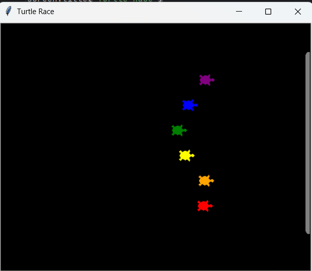

# 🐢 Turtle Race Game in Python (Turtle Graphics)

A fun **Turtle Race game** built using Python’s `turtle` module.  
Players can bet on a turtle color and watch the race unfold across the screen.

---

## 🎮 How to Play

1. Enter your bet by choosing a color from the available turtles:  
   `red`, `orange`, `yellow`, `green`, `blue`, `purple`  
2. Watch the race.  
3. At the end, see if your turtle won.  
4. Decide whether to play another round.

---

## 🚀 Features

- User can place bets on turtle colors
- Randomized movement makes each race different
- Option to continue playing after each race
- Turtle race track with end line
- GUI using Turtle graphics

---

## 🛠️ Technologies Used

- Python 3.11
- turtle
- random
- Object-Oriented Programming
- Docker (for containerization practice)

---

## 📂 Project Structure
```bash
turtle-race/
│
├── main.py
├── requirements.txt
├── Dockerfile
├── docker-compose.yml
└── README.md
```

---

## ▶️ Run Locally (Recommended)

```bash
git clone https://github.com/Fayyaz6137/Turtles_Race_Game_GUI_Python.git

cd turtle-race-game-gui-python

pip install -r requirements.txt

python main.py
```

---

## 🐳 Run With Docker

```bash
docker compose up --build
```
⚠️ Since this is a GUI application, running inside Docker requires an X server (e.g., VcXsrv on Windows).

---

## 🖼️ Game Screenshot

